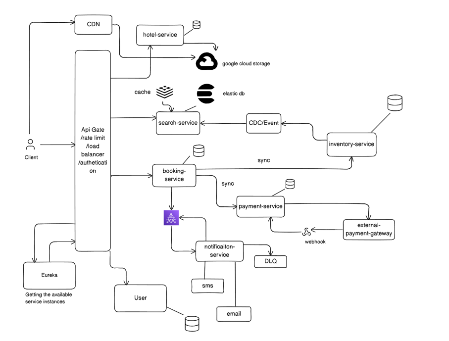

# Multi-Tenant Property Booking System

## Table of contents

- [Project overview](#project-overview)
- [Features](#features)
- [Requirements and problem statement](#requirements-and-problem-statement)
- [Architecture](#architecture)
- [Tech stack](#tech-stack)
- [Project structure](#project-structure)
---

## Project overview

This repository implements a **microservices-based** hotel booking platform: clear **bounded contexts**, **dedicated databases** per service, an **API Gateway** entry point, **Eureka** service discovery, and **event-driven** patterns where they improve resilience (e.g. notifications, search freshness via **CDC**).

The design is **multi-tenant aware** at the identity layer so the same platform patterns can serve multiple property operators as the product matures.

---

## Features

### End-user (client)

- Sign up / sign in (JWT session)
- Search hotels by **name**, **location**, and **date range**; filters for **price**, **reviews**, and **rating** (**proximity** and ranking in **Search** layer)
- Hotel detail: metadata, amenities, room types, images (CDN-backed URLs)
- Select room type and view **price breakdown**
- **Book** and **pay** (coordinated **Booking**, **Inventory**, **Payment** services—target design)
- **Notifications** on booking status changes (async, broker-backed—target design)
- Profile: **past bookings**, profile management
- **Cancellation policy (business rule):** cancel **≥ 5 days** before check-in → **100%** refund; later → **20%** refund (to be enforced in booking/payment rules)

### Administrator

- Onboard and manage **hotels** and **rooms**
- Manage **bookings** (view / update / cancel) with inventory and payment consistency in mind
---

## Requirements and problem statement

| Requirement | How the architecture addresses it |
|---------------|-----------------------------------|
| **High read load on search** | Dedicated **Search** store (Elasticsearch) with denormalized documents; **cache**-friendly access patterns |
| **Fresh availability vs. catalog** | **CDC** from **Inventory** (and catalog sources) into **Search** so listings reflect stock without synchronous coupling |
| **Concurrent bookings** | **Optimistic locking** (`version`) on availability rows |
| **Reliable payments** | **Idempotency keys** on payments; integration with an external **payment gateway** |
| **Non-blocking notifications** | **Message broker** between booking/payment and **Notification** service; **DLQ** for failures |
| **Operational isolation** | **One database per service**; cross-service references are **logical IDs** validated via APIs and sagas |
| **Secure administration** | **Role-based access** (`USER` / `ADMIN`) and protected admin APIs (implemented in **User Service**) |

---

## Architecture

Traffic flows through an **API Gateway**, which applies routing and (over time) cross-cutting concerns such as authentication and rate limiting. **Netflix Eureka** provides **service discovery** so callers resolve healthy instances of **User**, **Hotel**, **Search**, **Inventory**, **Booking**, **Payment**, and **Notification** services.

**Communication patterns**

| Pattern | Use case |
|--------|----------|
| **Synchronous (REST)** | Booking path: check **Inventory**, persist **Booking**, call **Payment** when payment is in scope |
| **Asynchronous (events / broker)** | Booking or payment state changes trigger **Notification** (SMS / email) without blocking the user-facing request |
| **CDC (Change Data Capture)** | **Inventory** (and catalog-related) database changes stream into **Search** so filters, geo, and availability stay aligned |

  

**Service responsibilities**

| Service | Responsibility |
|---------|----------------|
| **API Gateway** | Single entry point; routes to downstream services |
| **Discovery (Eureka)** | Service registry and health awareness |
| **User** | Sign-up / sign-in, JWT, roles (`USER`, `ADMIN`), profile data; bootstrap admin |
| **Hotel** | Hotel metadata, amenities, room types, media references |
| **Search** | Query by name, location, dates; filters; proximity / ranking |
| **Inventory** | Per-date availability, pricing, optimistic locking |
| **Booking** | Lifecycle (`INITIATED` → `CONFIRMED` / `CANCELLED`), line items and price breakdown |
| **Payment** | Gateway integration, persistence, idempotency |
| **Notification** | SMS/email; DLQ for retries |

---

## Tech stack

| Area | Choices (target / in use)                                                                                          |
|------|--------------------------------------------------------------------------------------------------------------------|
| Language | Java 21                                                                                                            |
| Framework | Spring Boot (per service)                                                                                          |
| API | REST; OpenAPI where exposed                                                                                        |
| Security | JWT; RBAC (`USER`, `ADMIN`) in **User Service**                                                                    |
| Discovery | Spring Cloud Netflix **Eureka**                                                                                    |
| Gateway | Spring Cloud Gateway–based **API Gateway**                                                                         |
| Data | PostgreSQL (users, availability, bookings, payments), MongoDB (hotel catalog), Elasticsearch (search index), Redis |
| Messaging | Kafka for notifications and domain events — *integration in progress*                                 |
